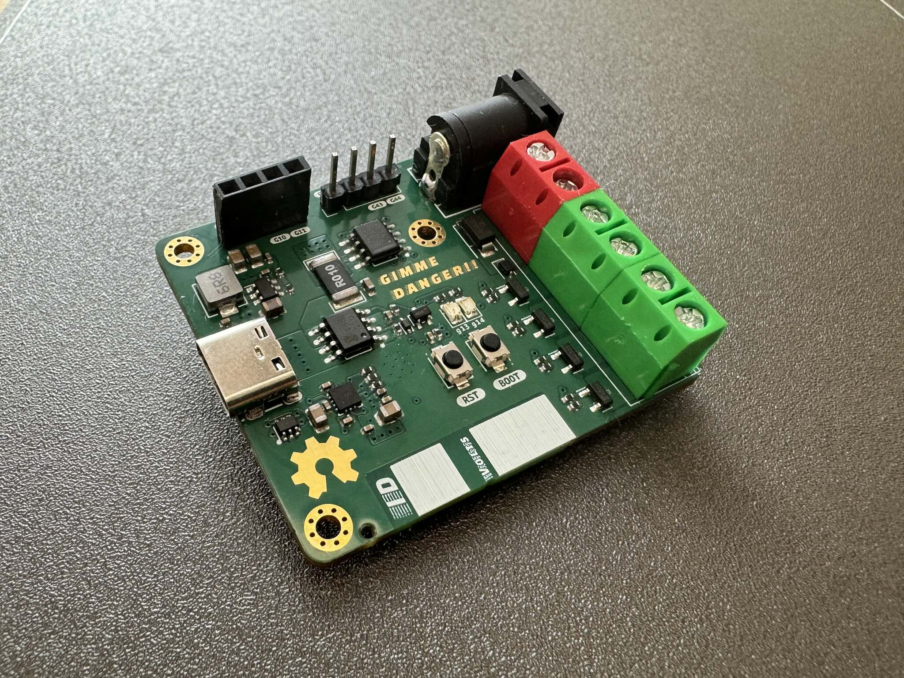
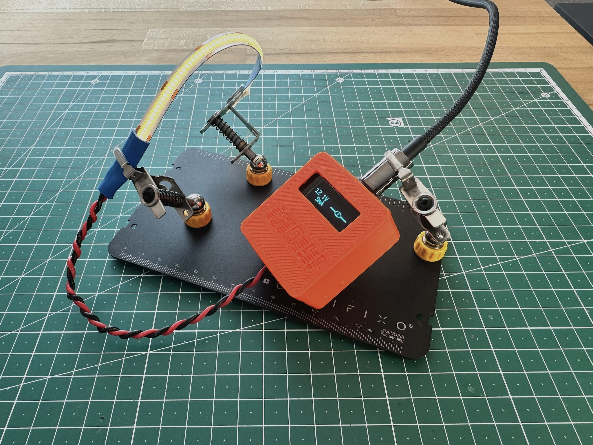

An open source [USB Power Delivery](https://en.wikipedia.org/wiki/USB_hardware#USB_Power_Delivery) trigger board and 5-channel PWM controller that runs [ESPHome](https://esphome.io).

_GIMME DANGER!!_ negotiates up to 21 V and 3 A[^1] from a USB Power Delivery (USB-PD) capable source -- such as common USB-C wall adapters/chargers and power banks -- and provides controls for its 5 PWM channels, optionally via [Home Assistant](https://home-assistant.io). Each channel can be used to interface with LEDs, motors and more. See below for some video demos.

# Hardware

* [ESP32-S3](https://www.espressif.com/en/products/socs/esp32-s3) module, mounted on the [back of the PCB](./media/gimme-danger-back.jpg)
* [FUSB302B](https://www.onsemi.com/products/interfaces/usb-type-c/fusb302b) USB-PD controller
* [INA219](https://www.ti.com/product/INA219) current sensor
* 5 output PWM channels
* 2x5.5mm barrel jack for raw output voltage access
* Optional OLED display

The [`kicad/`](./kicad/) directory contains design files and fabrication files for [JLCPCB](https://jlcpcb.com) manufacturing and assembly. The big through-hole components (headers, power terminals) and the ESP32-S3 module are not included in the assembly, and expected to be soldered by hand.

# Software
A custom `fusb302` component was implemented in ESPHome to support this project. It currently lives in its own fork on [github.com/rbaron/tree/fusb302](https://github.com/rbaron/esphome/tree/fusb302).

Here's a minimal example of using our custom `fusb302` component with ESPHome:

```yaml
external_components:
  - source:
      type: git
      url: https://github.com/rbaron/esphome
      ref: fusb302
    components: [fusb302]

fusb302:
  id: fusb302_id
  i2c_id: i2c_bus_fusb302
  interrupt_pin: GPIO5
  voltage: 12000 mV
  current: 1000 mA
  on_pd_negotiation_success:
    then:
      - switch.turn_on: load_switch
```

Full ESPHome configs for the demos below and more are available in the [`code/`](./code) directory.

# ‼️ Safety disclaimer ‼️
Configuration mistakes or software bugs may toast your devices if a high voltage is accidentally negotiated. While I have never run into these issues, even during development, be extra mindful of this fact then using this project or the `fusb302` component separately. Use it at your own risk.

# Supported Power Delivery features
* USB-PD 2.0 Fixed voltages -- 5V, 9V, 12V, 15V, 20V
* USB-PD 3.0 Programmable Power Supply (PPS) -- 3.3V-21V, in 20mV steps (see the power supply demo below)
* USB-PD 3.1 Extended Power Range (EPR) Fixed PDOs -- 28V[^1]

Support for USB-PD 3.1 Adjustable Voltage Supply (AVS) in EPR mode will let us pull 15-28V[^1]. Unfortunately it's still difficult to get our hands on EPR AVS capable sources to implement and test support for it, but in theory the heavy lifting is already done.

# Some use cases & demos
Below there are some demo videos. Click on the images to play.

## 12V LED strip
The main motivation for this project was to power short runs of LED strips from USB-C chargers and control them via Home Assistant. Observing the maximum current and voltage[^1], it should be doable to light up a shelf, table, TV stand or any DYI project that requires only a couple of meters of 12V LED strips. Here [wled-calculator.github.io](https://wled-calculator.github.io/) should help with planning.

In the video below we see _GIMME DANGER!!_ connected to [Home Assistant](https://www.home-assistant.io), controlling a short 12V LED strip.
[](https://youtu.be/a7QtX55lgi8)

## 12V RGBW LED strip
[](https://youtu.be/ThnvIa4zbsM)

## A lil' programmable power supply
What's fun is that we can negotiate voltages on the fly from USB-PD 3.0 sources that offer Programmable Power Supply (PPS) modes. Here we have a potentiometer that sets the target voltage, and a button that triggers the USB-PD negotiation for that voltage.

A tiny power supply that's powered by the same USB-C charger as my [soldering iron](https://pine64.com/product/pinecil-smart-mini-portable-soldering-iron/) sounds like a neat portable tool.

[](https://youtu.be/3Acu_VfSuck)

## A Home Assistant controlled power supply
As a display of the flexibility of ESPHome and Home Assistant, we can use _GIMME DANGER!!_ to make a WiFi-controlled power supply. This is an objectively terrible idea, but it's not _GIMME SAFETY!!_ after all. Disregarding the risk of accidentally toasting our loads either via a misclick or a bug, this may be useful for automating the collection of I-V curves.

[](https://youtu.be/tXYciUaycYI)

# Optional OLED display
There are female pin headers on the board to connect an 0.91" OLED display like [this one from Aliexpress](https://aliexpress.com/item/1005004816561244.html). It's used to display the running voltage and current. There's also a cute animation when negotiation is succesful -- you can see it in the demos above.

# 3D printed case

The [`case/`](./case) directory contains a little 3D printable case. The PCB is optionally held in place by three M2 screws and threaded inserts.

# License
The hardware and associated design files are released under the [Creative Commons CC BY-SA 4.0](https://creativecommons.org/licenses/by-sa/4.0/) license. The code is released under the [MIT license](https://opensource.org/licenses/MIT).


[^1]: FUSB302B's typical maximum voltage is 21 V, with 28 V as the absolute maximum. Each PWM channel is rated for 3 A. In theory the board supports up to 5 A, but a safer, better tested range is 21 V / 3 A in total.