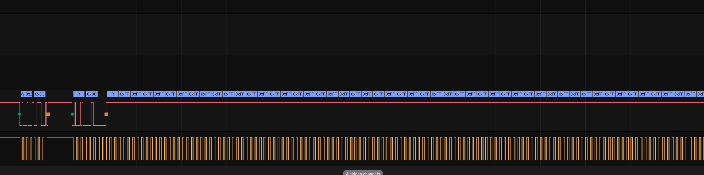
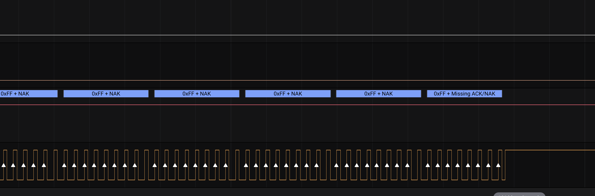
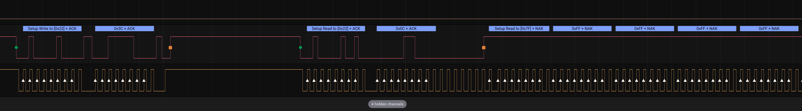
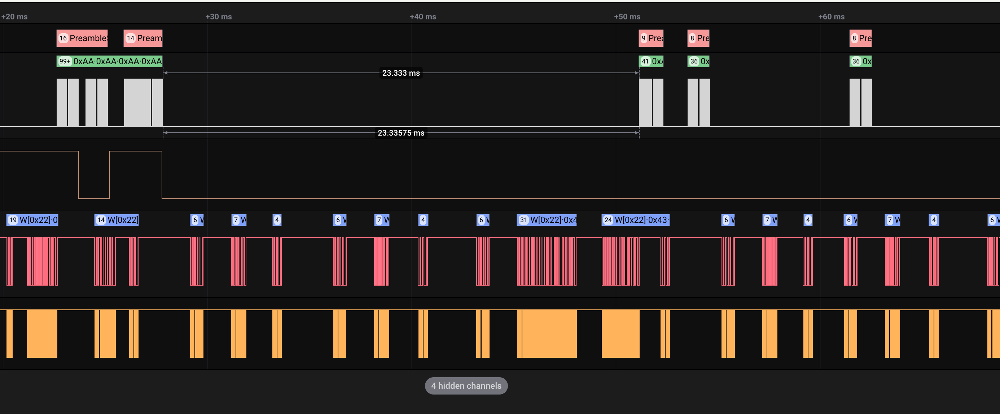
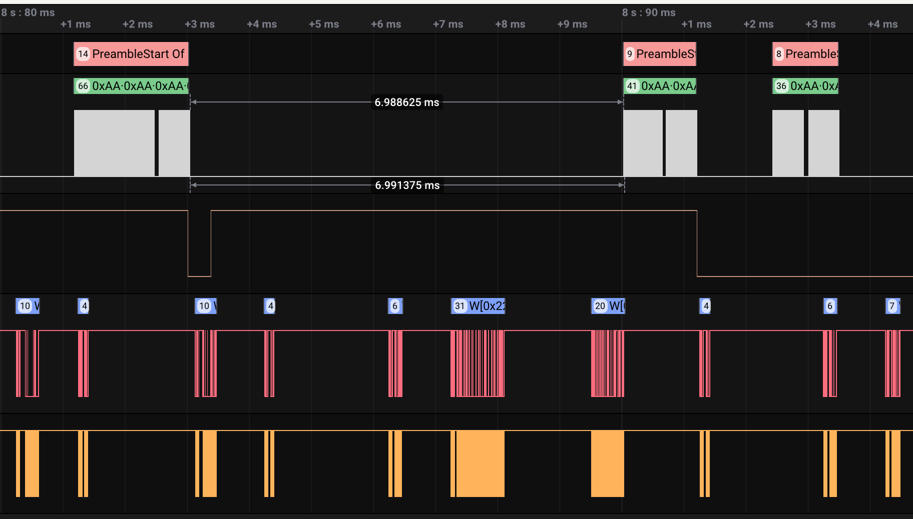

# 2024-04-26
# gimme danger 0.0.3a 1
Running with WiFi + OTA + single PWM channel + no interrupts + single i2c @ 100kHz (no INA nor OLED). Still running after 1h20 with ZERO ERRORS!!

Adding the INA sensor.

# 2024-04-16
According to [ESP32-S3 docs](https://docs.espressif.com/projects/esp-idf/en/latest/esp32s3/api-reference/peripherals/i2c.html#inter-integrated-circuit-i2c), the i2c frequency should not exceed 400kHz!

Issues with i2c on esp-idf:
- i2c 1s hang if no Ack
  - [esp-idf issue](https://github.com/espressif/esp-idf/issues/4999)
  - Apparently fixed? https://github.com/espressif/esp-idf/issues/12079
    - In [this commit](https://github.com/espressif/esp-idf/commit/793ca6d7a48120722e848f408e363345ee63fd09)


# 2024-04-15

I am using a FUSB302 and most projects use FUSB302B ??  WHY???

# gimme danger 3
- Added 100n + 10uF to the ESP32
- Added 100n to FUSB302
- Added 5.1k pull-up to SDA and SDL (in parallel with existing 4.7k)

Trying without interrupt, just polling to force errors. Still errors...
The i2c lines look clean on the oscilloscope. What the hell?
- Power spikes due to wifi?

With esp-idf, no WiFi: 6 errors in 6 minutes
With esp-idf, WiFi+API+OTA, NO logger: failed after 1h or so

I am missing a 10uF+ cap on VCONN!!

# 2024-04-14
## gimme danger 1
Will try more destructive methods.
### Hypohtesis 1
i2c cross talk. I will attempt to sever the i2c lines and directly connect FUSB302 to the ESP32 (different, unused pins). 10k pull-up may be already enough hopefully?

First, I disable interrupt and just do fast polling to force more errors.
- [pre-botch](./debug-files/logs/crosstalk/gimmedanger1-pre-botch.txt)
  - Few errors per second.

# Gimme danger 0.0.1a
Let's try it on the 0.0.0a version. It has pretty short, spaced out i2c line.
500kHz, with no wifi: No errors!!!!!!!!
500kHz, with wifi and ota and api: ~6 errors in 3 minutes
100kHz, with wifi and ota and api: ~50 in 5 minutes
1000kHz, with wifi and ota and api: ~32 in 4 minutes
100kHz, with wifi and ota but NO api: ~13 in 4 minutes

# Gimme danger 4
100kHz, no wifi: Very few errors. 3 errors in 3 minutes.
500kHz, no wifi: ~1err/min


# 2024-04-13
Let's try to establish a baseline. Flashing gimme danger 1:
- No WiFi
- No  PWM
- 11V PPS
- 470 uF cap
- Logger ON WARN

Some bad ringing on the SDA line (NewFile2.png) at 500Hz. Cross talk with SCL?
Started: 10h10

Not a good sign...
```
[10:19:56][W][fusb302.component:605]: Ok! Re-requesting PPS PDO.
[10:19:56][W][fusb302.component:720]: Failed to write register 0x43 with error 2. Retrying...
[10:19:56][W][fusb302.component:720]: Failed to write register 0x43 with error 2. Retrying...
[10:19:56][W][fusb302.component:610]: Done re-requesting PDO. Re-scheduling PPS timer
[10:19:56][W][fusb302.component:796]: Watchdog expected READY state (and we're at 3) -- sending a soft reset (test: -112).
[10:19:56][E][fusb302.component:800]: Soft reset sent.
[10:19:56][W][fusb302.component:418]: Accept message received
[10:19:56][W][fusb302.component:418]: Accept message received
[10:19:56][W][fusb302.component:421]: PS_RDY message received
```

Failed at 10h38:
```
[10:38:36][W][fusb302.component:789]: Watchdog expired, but we're in READY state. Not doing anything.
[10:38:43][W][fusb302.component:601]: Maybe rerequesting PPS PDO. State is: 5
[10:38:43][W][fusb302.component:605]: Ok! Re-requesting PPS PDO.
[10:38:43][W][fusb302.component:720]: Failed to write register 0x43 with error 2. Retrying...
[10:38:43][W][fusb302.component:720]: Failed to write register 0x43 with error 2. Retrying...
[10:38:43][W][fusb302.component:610]: Done re-requesting PDO. Re-scheduling PPS timer
[10:38:43][E][fusb302.component:431]: Soft_Reset received, replied with Accept
[10:38:44]ESP-ROM:esp32s3-20210327
[10:38:44]Build:Mar 27 2021
[10:38:44]rst:0x1 (POWERON),boot:0xa (SPI_FAST_FLASH_BOOT)
[10:38:44]SPIWP:0xee
[10:38:44]mode:DIO, clock div:1
[10:38:44]load:0x3fce3808,len:0x43c
[10:38:44]load:0x403c9700,len:0xbec
[10:38:44]load:0x403cc700,len:0x2a3c
[10:38:44]entry 0x403c98d8
```

Redoing it while capturing.
Started: 10h43
Reboot: 15h49

```
[15:49:06][W][fusb302_trigger:127]: PD negotiation success outcome: 1
[15:49:06][W][fusb302.component:789]: Watchdog expired, but we're in READY state. Not doing anything.
[15:49:13][W][fusb302.component:601]: Maybe rerequesting PPS PDO. State is: 5
[15:49:13][W][fusb302.component:605]: Ok! Re-requesting PPS PDO.
[15:49:13][W][fusb302.component:720]: Failed to write register 0x43 with error 2. Retrying...
[15:49:13][W][fusb302.component:720]: Failed to write register 0x43 with error 2. Retrying...
[15:49:13][W][fusb302.component:610]: Done re-requesting PDO. Re-scheduling PPS timer
[15:49:13][W][fusb302.component:796]: Watchdog expected READY state (and we're at 3) -- sending a soft reset (test: -2648).
[15:49:13][E][fusb302.component:800]: Soft reset sent.
[15:49:13][W][fusb302.component:418]: Accept message received
[15:49:14]ESP-ROM:esp32s3-20210327
[15:49:14]Build:Mar 27 2021
[15:49:14]rst:0x1 (POWERON),boot:0x8 (SPI_FAST_FLASH_BOOT)
[15:49:14]SPIWP:0xee
[15:49:14]mode:DIO, clock div:1
[15:49:14]load:0x3fce3808,len:0x43c
[15:49:14]load:0x403c9700,len:0xbec
[15:49:14]load:0x403cc700,len:0x2a3c
[15:49:14]entry 0x403c98d8
[15:49:15][W][fusb302.component:418]: Accept message received
[15:49:15][W][fusb302.component:421]: PS_RDY message received
[15:49:15][W][fusb302_trigger:127]: PD negotiation success outcome: 1
[15:49:15][W][fusb302.component:796]: Watchdog expected READY state (and we're at 5) -- sending a soft reset (test: 0).
[15:49:15][E][fusb302.component:800]: Soft reset sent.
[15:49:15][W][fusb302.component:418]: Accept message received
[15:49:15][W][fusb302.component:418]: Accept message received
[15:49:15][W][fusb302.component:421]: PS_RDY message received
```

After reboot it kept going. Until 21h40, two more reboots. But I noticed we managed to respond to 6 Soft_Resets!
```
[21:33:30][W][fusb302.component:789]: Watchdog expired, but we're in READY state. Not doing anything.
[21:33:37][W][fusb302.component:601]: Maybe rerequesting PPS PDO. State is: 5
[21:33:37][W][fusb302.component:605]: Ok! Re-requesting PPS PDO.
[21:33:37][W][fusb302.component:720]: Failed to write register 0x43 with error 2. Retrying...
[21:33:37][W][fusb302.component:720]: Failed to write register 0x43 with error 2. Retrying...
[21:33:37][W][fusb302.component:610]: Done re-requesting PDO. Re-scheduling PPS timer
[21:33:37][E][fusb302.component:431]: Soft_Reset received, replied with Accept
[21:33:37][W][fusb302.component:720]: Failed to write register 0x43 with error 2. Retrying...
[21:33:37][W][fusb302.component:720]: Failed to write register 0x43 with error 2. Retrying...
[21:33:37][W][fusb302.component:418]: Accept message received
[21:33:37][W][fusb302.component:421]: PS_RDY message received
[21:33:37][W][fusb302_trigger:127]: PD negotiation success outcome: 1
[21:33:37][W][fusb302.component:789]: Watchdog expired, but we're in READY state. Not doing anything.
[21:33:44][W][fusb302.component:601]: Maybe rerequesting PPS PDO. State is: 5
```

All of the six follow the exact same pattern:
```
[12:49:29][W][fusb302.component:605]: Ok! Re-requesting PPS PDO.
[12:49:29][W][fusb302.component:720]: Failed to write register 0x43 with error 2. Retrying...
[12:49:29][W][fusb302.component:720]: Failed to write register 0x43 with error 2. Retrying...
[12:49:29][W][fusb302.component:610]: Done re-requesting PDO. Re-scheduling PPS timer
[12:49:29][E][fusb302.component:431]: Soft_Reset received, replied with Accept
```

They always happen after two failures to write to 0x43 (fifo) with the error 2 (NOT_ACKNOWLEDGED).

The 3 reboots of the day were:
```
[15:49:06][W][fusb302_trigger:127]: PD negotiation success outcome: 1
[15:49:06][W][fusb302.component:789]: Watchdog expired, but we're in READY state. Not doing anything.
[15:49:13][W][fusb302.component:601]: Maybe rerequesting PPS PDO. State is: 5
[15:49:13][W][fusb302.component:605]: Ok! Re-requesting PPS PDO.
[15:49:13][W][fusb302.component:720]: Failed to write register 0x43 with error 2. Retrying...
[15:49:13][W][fusb302.component:720]: Failed to write register 0x43 with error 2. Retrying...
[15:49:13][W][fusb302.component:610]: Done re-requesting PDO. Re-scheduling PPS timer
[15:49:13][W][fusb302.component:796]: Watchdog expected READY state (and we're at 3) -- sending a soft reset (test: -2648).
[15:49:13][E][fusb302.component:800]: Soft reset sent.
[15:49:13][W][fusb302.component:418]: Accept message received
[15:49:14]ESP-ROM:esp32s3-20210327
[15:49:14]Build:Mar 27 2021
[15:49:14]rst:0x1 (POWERON),boot:0x8 (SPI_FAST_FLASH_BOOT)

[17:49:31][W][fusb302.component:789]: Watchdog expired, but we're in READY state. Not doing anything.
[17:49:38][W][fusb302.component:601]: Maybe rerequesting PPS PDO. State is: 5
[17:49:38][W][fusb302.component:605]: Ok! Re-requesting PPS PDO.
[17:49:38][W][fusb302.component:720]: Failed to write register 0x43 with error 2. Retrying...
[17:49:38][W][fusb302.component:720]: Failed to write register 0x43 with error 2. Retrying...
[17:49:38][W][fusb302.component:610]: Done re-requesting PDO. Re-scheduling PPS timer
[17:49:38][W][fusb302.component:796]: Watchdog expected READY state (and we're at 3) -- sending a soft reset (test: -1043).
[17:49:38][E][fusb302.component:800]: Soft reset sent.
[17:49:38][W][fusb302.component:418]: Accept message received
[17:49:38][W][fusb302.component:720]: Failed to write register 0x43 with error 2. Retrying...
[17:49:38][W][fusb302.component:720]: Failed to write register 0x43 with error 2. Retrying...
[17:49:38][W][fusb302.component:720]: Failed to write register 0x43 with error 2. Retrying...
[17:49:38][W][fusb302.component:720]: Failed to write register 0x43 with error 2. Retrying...
[17:49:39]ESP-ROM:esp32s3-20210327
[17:49:39]Build:Mar 27 2021
[17:49:39]rst:0x1 (POWERON),boot:0x2b (SPI_FAST_FLASH_BOOT)


[21:14:57][W][fusb302.component:789]: Watchdog expired, but we're in READY state. Not doing anything.
[21:15:04][W][fusb302.component:601]: Maybe rerequesting PPS PDO. State is: 5
[21:15:04][W][fusb302.component:605]: Ok! Re-requesting PPS PDO.
[21:15:04][W][fusb302.component:610]: Done re-requesting PDO. Re-scheduling PPS timer
[21:15:04][W][fusb302.component:418]: Accept message received
[21:15:05][12325475][E][Wire.cpp:513] requestFrom(): i2cRead returned Error 263
[21:15:05][W][fusb302.component:693]: Failed to read register 0x43 with error 3. Retrying...
[21:15:05][E][fusb302.component:395]: CRC mismatch! 0x00000000 != 0xD6CFE97B
[21:15:05][E][fusb302.component:334]: Failed to read FIFO
[21:15:05][W][component:214]: Component fusb302 took a long time for an operation (1.03 s).
[21:15:05][W][component:215]: Components should block for at most 20-30ms.
[21:15:05][W][fusb302.component:781]: Interrupt is asserted. Something is wrong.
[21:15:05][W][fusb302.component:796]: Watchdog expected READY state (and we're at 4) -- sending a soft reset (test: -1773).
[21:15:05][E][fusb302.component:800]: Soft reset sent.
[21:15:05][E][fusb302.component:395]: CRC mismatch! 0x49E3F0BD != 0x44E3F0BD
[21:15:05][E][fusb302.component:334]: Failed to read FIFO
[21:15:05][W][fusb302.component:418]: Accept message received
[21:15:06]ESP-ROM:esp32s3-20210327
[21:15:06]Build:Mar 27 2021
[21:15:06]rst:0x1 (POWERON),boot:0x2b (SPI_FAST_FLASH_BOOT)

```

Overnight it failed a few more times...
```
[22:37:01][W][fusb302.component:610]: Done re-requesting PDO. Re-scheduling PPS timer
[22:37:01][W][fusb302.component:796]: Watchdog expected READY state (and we're at 3) -- sending a soft reset (test: -717).
[22:37:01][E][fusb302.component:800]: Soft reset sent.
[22:37:01][W][fusb302.component:418]: Accept message received
[22:37:01][E][fusb302.component:395]: CRC mismatch! 0xFFFFFFFF != 0x2ABDB53E
[22:37:01][E][fusb302.component:334]: Failed to read FIFO
[22:37:01][E][fusb302.component:395]: CRC mismatch! 0x00000000 != 0xCC8738D0
[22:37:01][E][fusb302.component:334]: Failed to read FIFO
[22:37:02]ESP-ROM:esp32s3-20210327
[22:37:02]Build:Mar 27 2021
[22:37:02]rst:0x1 (POWERON),boot:0xa (SPI_FAST_FLASH_BOOT)

[23:27:10][W][fusb302.component:720]: Failed to write register 0x43 with error 2. Retrying...
[23:27:10][W][fusb302.component:610]: Done re-requesting PDO. Re-scheduling PPS timer
[23:27:10][E][fusb302.component:431]: Soft_Reset received, replied with Accept
[23:27:12]ESP-ROM:esp32s3-20210327
[23:27:12]Build:Mar 27 2021
[23:27:12]rst:0x1 (POWERON),boot:0xa (SPI_FAST_FLASH_BOOT)

[23:27:10][W][fusb302.component:720]: Failed to write register 0x43 with error 2. Retrying...
[23:27:10][W][fusb302.component:720]: Failed to write register 0x43 with error 2. Retrying...
[23:27:10][W][fusb302.component:610]: Done re-requesting PDO. Re-scheduling PPS timer
[23:27:10][E][fusb302.component:431]: Soft_Reset received, replied with Accept
[23:27:12]ESP-ROM:esp32s3-20210327
[23:27:12]Build:Mar 27 2021
[23:27:12]rst:0x1 (POWERON),boot:0xa (SPI_FAST_FLASH_BOOT)

[00:04:45][W][fusb302.component:605]: Ok! Re-requesting PPS PDO.
[00:04:45][W][fusb302.component:720]: Failed to write register 0x43 with error 2. Retrying...
[00:04:45][W][fusb302.component:720]: Failed to write register 0x43 with error 2. Retrying...
[00:04:45][W][fusb302.component:610]: Done re-requesting PDO. Re-scheduling PPS timer
[00:04:45][E][fusb302.component:431]: Soft_Reset received, replied with Accept
[00:04:45][E][fusb302.component:395]: CRC mismatch! 0xC000DC00 != 0x951E9977
[00:04:45][E][fusb302.component:334]: Failed to read FIFO
[00:04:45][E][fusb302.component:395]: CRC mismatch! 0x00000000 != 0x9A363B09
[00:04:45][E][fusb302.component:334]: Failed to read FIFO
[00:04:46]ESP-ROM:esp32s3-20210327
[00:04:46]Build:Mar 27 2021
[00:04:46]rst:0x1 (POWERON),boot:0x2a (SPI_FAST_FLASH_BOOT)

[01:42:52][W][fusb302.component:605]: Ok! Re-requesting PPS PDO.
[01:42:52][W][fusb302.component:720]: Failed to write register 0x43 with error 2. Retrying...
[01:42:52][W][fusb302.component:720]: Failed to write register 0x43 with error 2. Retrying...
[01:42:52][W][fusb302.component:610]: Done re-requesting PDO. Re-scheduling PPS timer
[01:42:52][W][fusb302.component:720]: Failed to write register 0x43 with error 2. Retrying...
[01:42:52][W][fusb302.component:720]: Failed to write register 0x43 with error 2. Retrying...
[01:42:52][E][fusb302.component:431]: Soft_Reset received, replied with Accept
[01:42:53]ESP-ROM:esp32s3-20210327
[01:42:53]Build:Mar 27 2021
[01:42:53]rst:0x1 (POWERON),boot:0x2b (SPI_FAST_FLASH_BOOT)

[04:00:42][W][fusb302.component:789]: Watchdog expired, but we're in READY state. Not doing anything.
[04:00:49][W][fusb302.component:601]: Maybe rerequesting PPS PDO. State is: 5
[04:00:49][W][fusb302.component:605]: Ok! Re-requesting PPS PDO.
[04:00:49][W][fusb302.component:720]: Failed to write register 0x43 with error 2. Retrying...
[04:00:49][W][fusb302.component:720]: Failed to write register 0x43 with error 2. Retrying...
[04:00:49][W][fusb302.component:610]: Done re-requesting PDO. Re-scheduling PPS timer
[04:00:49][W][fusb302.component:796]: Watchdog expected READY state (and we're at 3) -- sending a soft reset (test: -1204).
[04:00:49][E][fusb302.component:800]: Soft reset sent.
[04:00:49][W][fusb302.component:418]: Accept message received
[04:00:49][W][fusb302.component:720]: Failed to write register 0x43 with error 2. Retrying...
[04:00:49][W][fusb302.component:720]: Failed to write register 0x43 with error 2. Retrying...
[04:00:50]ESP-ROM:esp32s3-20210327
[04:00:50]Build:Mar 27 2021
[04:00:50]rst:0x1 (POWERON),boot:0x2b (SPI_FAST_FLASH_BOOT)

[04:07:26][W][fusb302.component:789]: Watchdog expired, but we're in READY state. Not doing anything.
[04:07:33][W][fusb302.component:601]: Maybe rerequesting PPS PDO. State is: 5
[04:07:33][W][fusb302.component:605]: Ok! Re-requesting PPS PDO.
[04:07:33][W][fusb302.component:610]: Done re-requesting PDO. Re-scheduling PPS timer
[04:07:33][E][fusb302.component:395]: CRC mismatch! 0xFF99095A != 0xB499095A
[04:07:33][E][fusb302.component:334]: Failed to read FIFO
[04:07:33][E][fusb302.component:395]: CRC mismatch! 0x00000000 != 0xAF0DAED7
[04:07:33][E][fusb302.component:334]: Failed to read FIFO
[04:07:33][W][fusb302.component:796]: Watchdog expected READY state (and we're at 3) -- sending a soft reset (test: -60).
[04:07:33][E][fusb302.component:800]: Soft reset sent.
[04:07:33][W][fusb302.component:418]: Accept message received
[04:07:33][W][fusb302.component:720]: Failed to write register 0x43 with error 2. Retrying...
[04:07:33][W][fusb302.component:720]: Failed to write register 0x43 with error 2. Retrying...
[04:07:34]ESP-ROM:esp32s3-20210327
[04:07:34]Build:Mar 27 2021
[04:07:34]rst:0x1 (POWERON),boot:0x2a (SPI_FAST_FLASH_BOOT)

[05:43:42][W][fusb302.component:605]: Ok! Re-requesting PPS PDO.
[05:43:42][W][fusb302.component:720]: Failed to write register 0x43 with error 2. Retrying...
[05:43:42][W][fusb302.component:720]: Failed to write register 0x43 with error 2. Retrying...
[05:43:42][W][fusb302.component:610]: Done re-requesting PDO. Re-scheduling PPS timer
[05:43:42][E][fusb302.component:431]: Soft_Reset received, replied with Accept
[05:43:43]ESP-ROM:esp32s3-20210327
[05:43:43]Build:Mar 27 2021
[05:43:43]rst:0x1 (POWERON),boot:0xa (SPI_FAST_FLASH_BOOT)

[06:30:32][W][fusb302.component:789]: Watchdog expired, but we're in READY state. Not doing anything.
[06:30:39][W][fusb302.component:601]: Maybe rerequesting PPS PDO. State is: 5
[06:30:39][W][fusb302.component:605]: Ok! Re-requesting PPS PDO.
[06:30:39][W][fusb302.component:720]: Failed to write register 0x43 with error 2. Retrying...
[06:30:39][W][fusb302.component:720]: Failed to write register 0x43 with error 2. Retrying...
[06:30:39][W][fusb302.component:610]: Done re-requesting PDO. Re-scheduling PPS timer
[06:30:39][W][fusb302.component:796]: Watchdog expected READY state (and we're at 3) -- sending a soft reset (test: -404).
[06:30:39][E][fusb302.component:800]: Soft reset sent.
[06:30:39][W][fusb302.component:418]: Accept message received
[06:30:39][W][fusb302.component:720]: Failed to write register 0x43 with error 2. Retrying...
[06:30:39][W][fusb302.component:720]: Failed to write register 0x43 with error 2. Retrying...
[06:30:40]ESP-ROM:esp32s3-20210327
[06:30:40]Build:Mar 27 2021
[06:30:40]rst:0x1 (POWERON),boot:0x2b (SPI_FAST_FLASH_BOOT)

[07:36:06][W][fusb302.component:610]: Done re-requesting PDO. Re-scheduling PPS timer
[07:36:06][W][fusb302.component:418]: Accept message received
[07:36:07][3927130][E][Wire.cpp:513] requestFrom(): i2cRead returned Error 263
[07:36:07][W][fusb302.component:693]: Failed to read register 0x43 with error 3. Retrying...
[07:36:07][E][fusb302.component:395]: CRC mismatch! 0x0000293B != 0x293B1401
[07:36:07][E][fusb302.component:334]: Failed to read FIFO
[07:36:07][W][component:214]: Component fusb302 took a long time for an operation (1.02 s).
[07:36:07][W][component:215]: Components should block for at most 20-30ms.
[07:36:07][W][fusb302.component:796]: Watchdog expected READY state (and we're at 4) -- sending a soft reset (test: -573).
[07:36:07][E][fusb302.component:800]: Soft reset sent.
[07:36:07][W][fusb302.component:693]: Failed to read register 0x41 with error 2. Retrying...
[07:36:07][W][fusb302.component:418]: Accept message received
[07:36:07][E][fusb302.component:395]: CRC mismatch! 0xFFFFFFFF != 0xC046C7B6
[07:36:07][E][fusb302.component:334]: Failed to read FIFO
[07:36:07][E][fusb302.component:395]: CRC mismatch! 0x00000000 != 0x9A363B09
[07:36:07][E][fusb302.component:334]: Failed to read FIFO
[07:36:09]ESP-ROM:esp32s3-20210327
[07:36:09]Build:Mar 27 2021
[07:36:09]rst:0x1 (POWERON),boot:0x2b (SPI_FAST_FLASH_BOOT)


```


# 2024-04-12
## gimme danger 1
Running with 500kHz. Observed new failure while capturing with logic analyzer:
```
[10:11:36][W][fusb302_trigger:124]: PD negotiation success outcome: 1
[10:11:37][W][fusb302.component:789]: Watchdog expired, but we're in READY state. Not doing anything.
[10:11:43][W][fusb302.component:601]: Maybe rerequesting PPS PDO. State is: 5
[10:11:43][W][fusb302.component:605]: Ok! Re-requesting PPS PDO.
[10:11:43][W][fusb302.component:610]: Done re-requesting PDO. Re-scheduling PPS timer
[10:11:43][W][fusb302.component:418]: Accept message received
[10:11:43][E][fusb302.component:395]: CRC mismatch! 0x00000000 != 0x8454A59F
[10:11:43][E][fusb302.component:334]: Failed to read FIFO
[10:11:44][W][fusb302.component:796]: Watchdog expected READY state (and we're at 4) -- sending a soft reset (test: -455).
[10:11:44][E][fusb302.component:800]: Soft reset sent.
[10:11:44][W][fusb302.component:418]: Accept message received
[10:11:44][3163948][E][Wire.cpp:513] requestFrom(): i2cRead returned Error -1
[10:11:44][W][fusb302.component:693]: Failed to read register 0x41 with error 3. Retrying...
[10:11:44]ESP-ROM:esp32s3-20210327
[10:11:44]Build:Mar 27 2021
[10:11:44]rst:0x1 (POWERON),boot:0x2b (SPI_FAST_FLASH_BOOT)
[10:11:44]SPIWP:0xee
[10:11:44]mode:DIO, clock div:1
[10:11:44]load:0x3fce3808,len:0x43c
[10:11:44]load:0x403c9700,len:0xbec
[10:11:44]load:0x403cc700,len:0x2a3c
[10:11:44]entry 0x403c98d8
```

This is saved in [](./debug-files/logic2/gd1-reboot1.sal). Found a bug:
```
- constexpr uint8_t kI2CSLeepBetweenAttemptsMS = 100;  // Waaaay too much.
+ constexpr uint8_t kI2CSLeepBetweenAttemptsMS = 1;
```

Let's try again. I also left the high_freq_loop_requestor always on and a bunch of test delays that I introduced.

There's a problematic i2c error that sometimes happens for 1s:


Why? And why does it stop after 1s? It ends like this:


If this happens when we need to reply fast, that's trouble.
We were reading from register 0x0c?? Which is... RESET? And it's not readable!! WHY??? WRONG! it's not writing, we're reading from 0x3c:



Also idea: we can trigger the src to send a Soft_Reset by sending some gibberish.

## gimme danger 4
Failed overnight after 7h:
```
[05:47:54][W][fusb302.component:608]: Done re-requesting PDO. Re-scheduling PPS timer
[05:47:55][24561918][E][Wire.cpp:513] requestFrom(): i2cRead returned Error 263
[05:47:55][W][fusb302.component:688]: Failed to read register 0x43 with error 3. Retrying...
[05:47:55][E][fusb302.component:394]: CRC mismatch! 0xA6E0BD2F != 0xBD2F4571
[05:47:55][E][fusb302.component:333]: Failed to read FIFO
[05:47:55][W][component:214]: Component fusb302 took a long time for an operation (1.13 s).
[05:47:55][W][component:215]: Components should block for at most 20-30ms.
[05:47:55][W][fusb302.component:776]: Interrupt is asserted. Something is wrong.
[05:47:55][E][fusb302.component:394]: CRC mismatch! 0x00000000 != 0xD6CFE97B
[05:47:55][E][fusb302.component:333]: Failed to read FIFO
[05:47:55][W][fusb302.component:790]: Watchdog expected READY state -- sending a soft reset (test: -3521).
[05:47:55][E][fusb302.component:794]: Soft reset sent.
[05:47:55][W][fusb302.component:417]: Accept message received
[05:47:55][W][fusb302.component:715]: Failed to write register 0x43 with error 2. Retrying...
[05:47:56]ESP-ROM:esp32s3-20210327
[05:47:56]Build:Mar 27 2021
[05:47:56]rst:0x1 (POWERON),boot:0x2b (SPI_FAST_FLASH_BOOT)
[05:47:56]SPIWP:0xee
[05:47:56]mode:DIO, clock div:1
[05:47:56]load:0x3fce3808,len:0x43c
[05:47:56]load:0x403c9700,len:0xbec
[05:47:56]load:0x403cc700,len:0x2a3c
[05:47:56]entry 0x403c98d8
[05:47:56][W][fusb302.component:417]: Accept message received
[05:47:56][W][fusb302.component:420]: PS_RDY message received
[05:47:56][W][fusb302_trigger:123]: PD negotiation success outcome: 1
[05:47:56][W][fusb302.component:790]: Watchdog expected READY state -- sending a soft reset (test: 0).
[05:47:56][E][fusb302.component:794]: Soft reset sent.
[05:47:56][W][fusb302.component:417]: Accept message received
[05:47:57][W][fusb302.component:417]: Accept message received
[05:47:57][W][fusb302.component:420]: PS_RDY message received
[05:47:57][W][fusb302_trigger:123]: PD negotiation success outcome: 1
[05:47:57][W][fusb302.component:790]: Watchdog expected READY state -- sending a soft reset (test: -1).
[05:47:57][E][fusb302.component:794]: Soft reset sent.
[05:47:57][W][fusb302.component:417]: Accept message received
[05:47:57][W][fusb302.component:417]: Accept message received
[05:47:57][W][fusb302.component:420]: PS_RDY message received
```

Apparently failed after not being able to quickly reply to the _second_ Source_Caps after Soft_Reset. I'm going to investigate why we have this double accept.
Well there's really no issue. The first Accept is from our Soft_Reset, and the second is from the Source_Caps message:

But it seems like we're taking >20ms to respond to the Source_Caps message after the Soft_Reset. Maybe our logging is getting in the way?
No! We're actually bottlenecked by the I2C comm:


This kinda explains why the default i2c bus of 50kHz is usually not enough. Trying 500kHz:

Now it takes ~6ms instead. We can still probably optimize the amount of reading we do.
Strangely it triggered a receive of a Soft_Reset, but we weren't able to process it in time it seems?
```
[09:18:52][W][fusb302.component:789]: Watchdog expired, but we're in READY state. Not doing anything.
[09:18:58][W][fusb302.component:601]: Maybe rerequesting PPS PDO. State is: 5
[09:18:58][W][fusb302.component:605]: Ok! Re-requesting PPS PDO.
[09:18:58][W][fusb302.component:720]: Failed to write register 0x43 with error 2. Retrying...
[09:18:59][W][fusb302.component:720]: Failed to write register 0x43 with error 2. Retrying...
[09:18:59][W][fusb302.component:610]: Done re-requesting PDO. Re-scheduling PPS timer
[09:18:59][W][component:214]: Component fusb302 took a long time for an operation (0.21 s).
[09:18:59][W][component:215]: Components should block for at most 20-30ms.
[09:18:59][E][fusb302.component:431]: Soft_Reset received, replied with Accept
[09:18:59][W][fusb302.component:781]: Interrupt is asserted. Something is wrong.
[09:19:00]ESP-ROM:esp32s3-20210327
[09:19:00]Build:Mar 27 2021
[09:19:00]rst:0x1 (POWERON),boot:0x2b (SPI_FAST_FLASH_BOOT)
[09:19:00]SPIWP:0xee
[09:19:00]mode:DIO, clock div:1
[09:19:00]load:0x3fce3808,len:0x43c
[09:19:00]load:0x403c9700,len:0xbec
[09:19:00]load:0x403cc700,len:0x2a3c
[09:19:00]entry 0x403c98d8
[09:19:00][W][fusb302.component:418]: Accept message received
```

# 2024-04-11
## gimme danger 4
Left it running for 12h overnight plugged into the baseus 27W charger. No failures! But some close calls?
```
[05:42:15][W][fusb302.component:784]: Watchdog expired, but we're in READY state. Not doing anything.
[05:42:22][W][fusb302.component:599]: Maybe rerequesting PPS PDO. State is: 5
[05:42:22][W][fusb302.component:603]: Ok! Re-requesting PPS PDO.
[05:42:22][W][fusb302.component:715]: Failed to write register 0x43 with error 2. Retrying...
[05:42:22][W][fusb302.component:715]: Failed to write register 0x43 with error 2. Retrying...
[05:42:22][W][fusb302.component:715]: Failed to write register 0x43 with error 2. Retrying...
[05:42:22][E][fusb302.component:719]: Exceeded max retries for writing register 0x43. Giving up.
[05:42:22][E][fusb302.component:586]: Failed to write eop to FIFO
[05:42:22][W][fusb302.component:608]: Done re-requesting PDO. Re-scheduling PPS timer
[05:42:22][W][component:214]: Component fusb302 took a long time for an operation (0.33 s).
[05:42:22][W][component:215]: Components should block for at most 20-30ms.
[05:42:22][W][fusb302.component:688]: Failed to read register 0x3c with error 2. Retrying...
[05:42:22][W][component:214]: Component fusb302 took a long time for an operation (0.11 s).
[05:42:22][W][component:215]: Components should block for at most 20-30ms.
[05:42:22][W][fusb302.component:790]: Watchdog expected READY state -- sending a soft reset (test: -4557).
[05:42:22][E][fusb302.component:794]: Soft reset sent.
[05:42:22][W][fusb302.component:417]: Accept message received
[05:42:22][W][fusb302.component:417]: Accept message received
[05:42:22][W][fusb302.component:420]: PS_RDY message received
```

Now I will try connecting it to the white 65W charger.

It worked for most of the day (8h - 15h, 15h - 19h), but failed once:

```
[15:05:01][W][fusb302.component:784]: Watchdog expired, but we're in READY state. Not doing anything.
[15:05:08][W][fusb302.component:599]: Maybe rerequesting PPS PDO. State is: 5
[15:05:08][W][fusb302.component:603]: Ok! Re-requesting PPS PDO.
[15:05:08][W][fusb302.component:608]: Done re-requesting PDO. Re-scheduling PPS timer
[15:05:08][W][fusb302.component:417]: Accept message received
[15:05:08][W][fusb302.component:420]: PS_RDY message received
[15:05:08][W][fusb302_trigger:123]: PD negotiation success outcome: 1
[15:05:08][W][fusb302.component:784]: Watchdog expired, but we're in READY state. Not doing anything.
[15:05:15][W][fusb302.component:599]: Maybe rerequesting PPS PDO. State is: 5
[15:05:15][W][fusb302.component:603]: Ok! Re-requesting PPS PDO.
[15:05:15][W][fusb302.component:608]: Done re-requesting PDO. Re-scheduling PPS timer
[15:05:15][W][fusb302.component:417]: Accept message received
[15:05:15][W][fusb302.component:420]: PS_RDY message received
[15:05:15][W][fusb302_trigger:123]: PD negotiation success outcome: 1
[15:05:15][W][fusb302.component:784]: Watchdog expired, but we're in READY state. Not doing anything.
[15:05:22][W][fusb302.component:599]: Maybe rerequesting PPS PDO. State is: 5
[15:05:22][W][fusb302.component:603]: Ok! Re-requesting PPS PDO.
[15:05:22][W][fusb302.component:715]: Failed to write register 0x43 with error 2. Retrying...
[15:05:22][W][fusb302.component:715]: Failed to write register 0x43 with error 2. Retrying...
[15:05:22][W][fusb302.component:608]: Done re-requesting PDO. Re-scheduling PPS timer
[15:05:22][W][component:214]: Component fusb302 took a long time for an operation (0.22 s).
[15:05:22][W][component:215]: Components should block for at most 20-30ms.
[15:05:22][W][fusb302.component:790]: Watchdog expected READY state -- sending a soft reset (test: -3515).
[15:05:22][E][fusb302.component:794]: Soft reset sent.
[15:05:22][W][fusb302.component:417]: Accept message received
[15:05:23]ESP-ROM:esp32s3-20210327
[15:05:23]Build:Mar 27 2021
[15:05:23]rst:0x1 (POWERON),boot:0x2b (SPI_FAST_FLASH_BOOT)
[15:05:23]SPIWP:0xee
[15:05:23]mode:DIO, clock div:1
[15:05:23]load:0x3fce3808,len:0x43c
[15:05:23]load:0x403c9700,len:0xbec
[15:05:23]load:0x403cc700,len:0x2a3c
[15:05:23]entry 0x403c98d8
[15:05:24][W][fusb302.component:417]: Accept message received
[15:05:24][W][fusb302.component:420]: PS_RDY message received
[15:05:24][W][fusb302_trigger:123]: PD negotiation success outcome: 1
[15:05:24][W][fusb302.component:790]: Watchdog expected READY state -- sending a soft reset (test: 0).
[15:05:24][E][fusb302.component:794]: Soft reset sent.
[15:05:24][W][fusb302.component:417]: Accept message received
[15:05:24][W][fusb302.component:417]: Accept message received
[15:05:24][W][fusb302.component:420]: PS_RDY message received
[15:05:24][W][fusb302_trigger:123]: PD negotiation success outcome: 1
[15:05:24][W][fusb302.component:790]: Watchdog expected READY state -- sending a soft reset (test: -1).
[15:05:24][E][fusb302.component:794]: Soft reset sent.
[15:05:24][W][fusb302.component:417]: Accept message received
[15:05:24][W][fusb302.component:417]: Accept message received
[15:05:24][W][fusb302.component:420]: PS_RDY message received
[15:05:24][W][fusb302_trigger:123]: PD negotiation success outcome: 1
[15:05:24][W][fusb302.component:784]: Watchdog expired, but we're in READY state. Not doing anything.
[15:05:30][W][wifi_esp32:482]: Event: Disconnected ssid='35c' bssid=F0:B0:14:D7:94:BE reason='Authentication Failed'
[15:05:30][W][wifi:651]: WiFi Unknown connection status 0
[15:05:31][W][fusb302.component:599]: Maybe rerequesting PPS PDO. State is: 5
[15:05:31][W][fusb302.component:603]: Ok! Re-requesting PPS PDO.
```

Usually when we send a soft reset, we read two Accept messages. Example:
```
[13:52:09][W][fusb302.component:608]: Done re-requesting PDO. Re-scheduling PPS timer
[13:52:09][W][component:214]: Component fusb302 took a long time for an operation (0.22 s).
[13:52:09][W][component:215]: Components should block for at most 20-30ms.
[13:52:09][W][fusb302.component:790]: Watchdog expected READY state -- sending a soft reset (test: -2885).
[13:52:09][E][fusb302.component:794]: Soft reset sent.
[13:52:09][W][fusb302.component:417]: Accept message received
[13:52:09][W][fusb302.component:417]: Accept message received
[13:52:09][W][fusb302.component:420]: PS_RDY message received

or

[13:35:05][W][fusb302.component:784]: Watchdog expired, but we're in READY state. Not doing anything.
[13:35:11][W][fusb302.component:599]: Maybe rerequesting PPS PDO. State is: 5
[13:35:11][W][fusb302.component:603]: Ok! Re-requesting PPS PDO.
[13:35:11][W][fusb302.component:608]: Done re-requesting PDO. Re-scheduling PPS timer
[13:35:11][E][fusb302.component:394]: CRC mismatch! 0xFFC5AFC1 != 0x81C2AFC1
[13:35:11][E][fusb302.component:333]: Failed to read FIFO
[13:35:11][E][fusb302.component:394]: CRC mismatch! 0x2E56D018 != 0x6960BC90
[13:35:11][E][fusb302.component:333]: Failed to read FIFO
[13:35:12][W][fusb302.component:790]: Watchdog expected READY state -- sending a soft reset (test: -2738).
[13:35:12][E][fusb302.component:794]: Soft reset sent.
[13:35:12][W][fusb302.component:417]: Accept message received
[13:35:12][W][fusb302.component:417]: Accept message received
[13:35:12][W][fusb302.component:420]: PS_RDY message received
[13:35:12][W][fusb302_trigger:123]: PD negotiation success outcome: 1
[13:35:12][W][fusb302.component:784]: Watchdog expired, but we're in READY state. Not doing anything.
[13:35:19][W][fusb302.component:599]: Maybe rerequesting PPS PDO. State is: 5
[13:35:19][W][fusb302.component:603]: Ok! Re-requesting PPS PDO.
```

So what happened is that probably we accepted the first Source_Caps message, but failed to Ack the second one on time. Why are we seeing two Accepts?

I'm going to try using 4 PWM channels on it.

Received Soft_Reset after  1h-ish, but still rebooted:
```
[22:28:27][W][fusb302_trigger:123]: PD negotiation success outcome: 1
[22:28:27][W][component:214]: Component fusb302 took a long time for an operation (0.12 s).
[22:28:27][W][component:215]: Components should block for at most 20-30ms.
[22:28:27][W][fusb302.component:784]: Watchdog expired, but we're in READY state. Not doing anything.
[22:28:34][W][fusb302.component:599]: Maybe rerequesting PPS PDO. State is: 5
[22:28:34][W][fusb302.component:603]: Ok! Re-requesting PPS PDO.
[22:28:34][W][fusb302.component:608]: Done re-requesting PDO. Re-scheduling PPS timer
[22:28:34][E][fusb302.component:429]: Soft_Reset received, replied with Accept
WARNING gimmedanger4 @ 192.168.178.205: Connection error occurred: [Errno 54] Connection reset by peer
INFO Processing unexpected disconnect from ESPHome API for gimmedanger4 @ 192.168.178.205
WARNING Disconnected from API
INFO Successfully connected to gimmedanger4 @ 192.168.178.205 in 0.127s
INFO Successful handshake with gimmedanger4 @ 192.168.178.205 in 0.084s
[22:29:19][W][fusb302.component:599]: Maybe rerequesting PPS PDO. State is: 5
[22:29:19][W][fusb302.component:603]: Ok! Re-requesting PPS PDO.
[22:29:19][W][fusb302.component:608]: Done re-requesting PDO. Re-scheduling PPS timer
[22:29:19][W][fusb302.component:417]: Accept message received
[22:29:19][W][fusb302.component:420]: PS_RDY message received
[22:29:19][W][fusb302_trigger:123]: PD negotiation success outcome: 1
[22:29:19][W][fusb302.component:784]: Watchdog expired, but we're in READY state. Not doing anything.
[22:29:26][W][fusb302.component:599]: Maybe rerequesting PPS PDO. State is: 5
```

Unfortunately logs were over network, so I can't see what happened after the soft reset.

It happed again quickly (after < 30min):

```
[22:58:24][W][fusb302_trigger:123]: PD negotiation success outcome: 1
[22:58:25][W][fusb302.component:784]: Watchdog expired, but we're in READY state. Not doing anything.
[22:58:31][W][fusb302.component:599]: Maybe rerequesting PPS PDO. State is: 5
[22:58:31][W][fusb302.component:603]: Ok! Re-requesting PPS PDO.
[22:58:31][W][fusb302.component:715]: Failed to write register 0x43 with error 2. Retrying...
[22:58:32][W][fusb302.component:715]: Failed to write register 0x43 with error 2. Retrying...
[22:58:32][W][fusb302.component:608]: Done re-requesting PDO. Re-scheduling PPS timer
[22:58:32][W][component:214]: Component fusb302 took a long time for an operation (0.22 s).
[22:58:32][W][component:215]: Components should block for at most 20-30ms.
[22:58:32][W][fusb302.component:790]: Watchdog expected READY state -- sending a soft reset (test: -258).
[22:58:32][E][fusb302.component:794]: Soft reset sent.
[22:58:32][W][fusb302.component:417]: Accept message received
[22:58:32][W][fusb302.component:688]: Failed to read register 0x43 with error 2. Retrying...
[22:58:33]ESP-ROM:esp32s3-20210327
[22:58:33]Build:Mar 27 2021
[22:58:33]rst:0x1 (POWERON),boot:0x2b (SPI_FAST_FLASH_BOOT)
[22:58:33]SPIWP:0xee
[22:58:33]mode:DIO, clock div:1
[22:58:33]load:0x3fce3808,len:0x43c
[22:58:33]load:0x403c9700,len:0xbec
[22:58:33]load:0x403cc700,len:0x2a3c
[22:58:33]entry 0x403c98d8
[22:58:33][W][fusb302.component:417]: Accept message received
[22:58:33][W][fusb302.component:420]: PS_RDY message received
[22:58:33][W][fusb302_trigger:123]: PD negotiation success outcome: 1
[22:58:33][W][fusb302.component:790]: Watchdog expected READY state -- sending a soft reset (test: 0).
[22:58:33][E][fusb302.component:794]: Soft reset sent.
[22:58:33][W][fusb302.component:417]: Accept message received
[22:58:33][W][fusb302.component:417]: Accept message received
[22:58:33][W][fusb302.component:420]: PS_RDY message received
[22:58:33][W][fusb302_trigger:123]: PD negotiation success outcome: 1
[22:58:33][W][fusb302.component:790]: Watchdog expected READY state -- sending a soft reset (test: -1).
[22:58:33][E][fusb302.component:794]: Soft reset sent.
[22:58:33][W][fusb302.component:417]: Accept message received
[22:58:34][W][fusb302.component:417]: Accept message received
[22:58:34][W][fusb302.component:420]: PS_RDY message received
[22:58:34][W][fusb302_trigger:123]: PD negotiation success outcome: 1
```

Could again be related to the 2-Accept issue.


## gimme danger 3
Reset a few times after 30m-1h when connected to the white 65W charger. I will try to connect it to the baseus 27W charger. There's no UART output, so I can't see what's happening.

It quickly reset too. Theories:
- Could it be the cable?
- Magnet in the case?
- Too many PWM channels?

I changed the light to a single PWM channel and removed it from the case. Used same cable.
Also rebooted after 1h. Now trying with a different cable. I also disabled logger and increased retries to 5.
Using the anker bio cable.

Note: looks like OTA requests more of WiFi or more time, so it often causes usb PD to reset...

It rebooted twice between 9h and 19h.

# 2024-04-10

- Could it be related to multiple PWM channels?
  - Quick test with RGBW reseted pretty fast
  - Also failed with only the white active, but maybe others still influence it?
    - After two hours
  - With all channels active, it failed after
- Logging via homeassistant API makes it slow?
- White charger less stable?

PPS 11V. gimme danger 4, only UART connected to PC.
Single failure from 10h00 to 18h30!

```
[13:13:41][W][fusb302_trigger:123]: PD negotiation success outcome: 1
[13:13:41][W][fusb302.component:776]: Watchdog expired, but we're in READY state. Not doing anything.
[13:13:48][W][fusb302.component:591]: Maybe rerequesting PPS PDO. State is: 5
[13:13:48][W][fusb302.component:595]: Ok! Re-requesting PPS PDO.
[13:13:48][W][fusb302.component:600]: Done re-requesting PDO. Re-scheduling PPS timer
[13:13:48][E][fusb302.component:393]: CRC mismatch! 0xFF38788F != 0x4A38788F
[13:13:48][E][fusb302.component:332]: Failed to read FIFO
[13:13:48][E][fusb302.component:393]: CRC mismatch! 0x2E56D018 != 0x6960BC90
[13:13:48][E][fusb302.component:332]: Failed to read FIFO
[13:13:48][W][fusb302.component:782]: Watchdog expected READY state -- sending a soft reset (test: -1621).
[13:13:48][E][fusb302.component:786]: Soft reset sent.
[13:13:48][W][fusb302.component:416]: Accept message received
[13:13:48][W][fusb302.component:416]: Accept message received
[13:13:48][W][fusb302.component:419]: PS_RDY message received
[13:13:48][W][fusb302_trigger:123]: PD negotiation success outcome: 1
[13:13:48][W][component:214]: Component fusb302 took a long time for an operation (0.06 s).
[13:13:48][W][component:215]: Components should block for at most 20-30ms.
[13:13:48][W][fusb302.component:776]: Watchdog expired, but we're in READY state. Not doing anything.
[13:13:55][W][fusb302.component:591]: Maybe rerequesting PPS PDO. State is: 5
[13:13:55][W][fusb302.component:595]: Ok! Re-requesting PPS PDO.
[13:13:55][W][fusb302.component:600]: Done re-requesting PDO. Re-scheduling PPS timer
[13:13:55][W][fusb302.component:416]: Accept message received
[13:13:55][W][fusb302.component:419]: PS_RDY message received
[13:13:55][W][fusb302_trigger:123]: PD negotiation success outcome: 1
[13:13:55][W][fusb302.component:776]: Watchdog expired, but we're in READY state. Not doing anything.
[13:14:02][W][fusb302.component:591]: Maybe rerequesting PPS PDO. State is: 5
[13:14:02][W][fusb302.component:595]: Ok! Re-requesting PPS PDO.
[13:14:02][W][fusb302.component:600]: Done re-requesting PDO. Re-scheduling PPS timer
[13:14:02][W][fusb302.component:416]: Accept message received
[13:14:02][W][fusb302.component:419]: PS_RDY message received
[13:14:02][W][fusb302_trigger:123]: PD negotiation success outcome: 1
[13:14:02][W][fusb302.component:776]: Watchdog expired, but we're in READY state. Not doing anything.
[13:14:09][W][fusb302.component:591]: Maybe rerequesting PPS PDO. State is: 5
[13:14:09][W][fusb302.component:595]: Ok! Re-requesting PPS PDO.
[13:14:09][W][fusb302.component:707]: Failed to write register 0x43 with error 2. Retrying...
[13:14:09][W][fusb302.component:707]: Failed to write register 0x43 with error 2. Retrying...
[13:14:09][W][fusb302.component:600]: Done re-requesting PDO. Re-scheduling PPS timer
[13:14:09][W][component:214]: Component fusb302 took a long time for an operation (0.22 s).
[13:14:09][W][component:215]: Components should block for at most 20-30ms.
[13:14:09][W][fusb302.component:422]: Unhandled command message type: 0x0D
[13:14:10][W][fusb302.component:768]: Interru\xf0ESP-ROM:esp32s3-20210327
[13:14:10]Build:Mar 27 2021
[13:14:10]rst:0x1 (POWERON),boot:0xb (SPI_FAST_FLASH_BOOT)
[13:14:10]SPIWP:0xee
[13:14:10]mode:DIO, clock div:1
[13:14:10]load:0x3fce3808,len:0x43c
[13:14:10]load:0x403c9700,len:0xbec
[13:14:10]load:0x403cc700,len:0x2a3c
[13:14:10]entry 0x403c98d8
[13:14:10][W][fusb302.component:416]: Accept message received
[13:14:11][W][fusb302.component:419]: PS_RDY message received
[13:14:11][W][fusb302_trigger:123]: PD negotiation success outcome: 1
[13:14:11][W][fusb302.component:782]: Watchdog expected READY state -- sending a soft reset (test: 0).
[13:14:11][E][fusb302.component:786]: Soft reset sent.
[13:14:11][W][fusb302.component:416]: Accept message received
[13:14:11][W][fusb302.component:416]: Accept message received
[13:14:11][W][fusb302.component:419]: PS_RDY message received
[13:14:11][W][fusb302_trigger:123]: PD negotiation success outcome: 1
[13:14:11][W][fusb302.component:782]: Watchdog expected READY state -- sending a soft reset (test: -1).
[13:14:11][E][fusb302.component:786]: Soft reset sent.
[13:14:11][W][fusb302.component:416]: Accept message received
[13:14:11][W][fusb302.component:416]: Accept message received
[13:14:11][W][fusb302.component:419]: PS_RDY message received
[13:14:11][W][fusb302_trigger:123]: PD negotiation success outcome: 1
[13:14:11][W][fusb302.component:776]: Watchdog expired, but we're in READY state. Not doing anything.
```

Power adapter sent a soft reset!!! Interesting!!
We should respond with Accept, and the source should re-send the Source_Caps message.


# 2024-04-09

## gimmedanger1
PPS 11V.

Failure 1:

This one is interesting because it's _after_ we receive an ACCEPT message.
```
[23:35:36][W][fusb302.component:591]: Maybe rerequesting PPS PDO. State is: 5
[23:35:36][W][fusb302.component:595]: Ok! Re-requesting PPS PDO.
[23:35:36][W][fusb302.component:600]: Done re-requesting PDO. Re-scheduling PPS timer
[23:35:36][E][fusb302.component:393]: CRC mismatch! 0x00000000 != 0xEED9CF56
[23:35:36][E][fusb302.component:332]: Failed to read FIFO
[23:35:37][W][fusb302.component:782]: Watchdog expected READY state -- sending a soft reset (test: -456).
[23:35:37][E][fusb302.component:786]: Soft reset sent.
[23:35:37][W][fusb302.component:416]: Accept message received
[23:35:37][E][fusb302.component:393]: CRC mismatch! 0xFFFFFFFF != 0x5D50E456
[23:35:37][E][fusb302.component:332]: Failed to read FIFO
[23:35:37][E][fusb302.component:393]: CRC mismatch! 0x00C19DB6 != 0x8D79EB26
[23:35:37][E][fusb302.component:332]: Failed to read FIFO
[23:35:37]ESP-ROM:esp32s3-20210327
[23:35:37]Build:Mar 27 2021
[23:35:37]rst:0x1 (POWERON),boot:0x2b (SPI_FAST_FLASH_BOOT)
[23:35:37]SPIWP:0xee
[23:35:37]mode:DIO, clock div:1
[23:35:37]load:0x3fce3808,len:0x43c
[23:35:37]load:0x403c9700,len:0xbec
[23:35:37]load:0x403cc700,len:0x2a3c
[23:35:37]entry 0x403c98d8
[23:35:38][W][fusb302.component:416]: Accept message received
[23:35:38][W][fusb302.component:419]: PS_RDY message received
[23:35:38][W][fusb302_trigger:123]: PD negotiation success outcome: 1
```

Failure 2: Happens because we failt to request a PDO after the Source_Caps message in time.
```
[23:36:00][W][fusb302_trigger:123]: PD negotiation success outcome: 1
[23:36:00][W][fusb302.component:776]: Watchdog expired, but we're in READY state. Not doing anything.
[23:36:07][W][fusb302.component:591]: Maybe rerequesting PPS PDO. State is: 5
[23:36:07][W][fusb302.component:595]: Ok! Re-requesting PPS PDO.
[23:36:07][E][fusb302.component:578]: Failed to write eop to FIFO
[23:36:07][W][fusb302.component:600]: Done re-requesting PDO. Re-scheduling PPS timer
[23:36:07][W][fusb302.component:782]: Watchdog expected READY state -- sending a soft reset (test: -6).
[23:36:07][E][fusb302.component:786]: Soft reset sent.
[23:36:07][E][fusb302.component:350]: Failed to read status1
[23:36:07][E][fusb302.component:350]: Failed to read status1
[23:36:08]ESP-ROM:esp32s3-20210327
[23:36:08]Build:Mar 27 2021
[23:36:08]rst:0x1 (POWERON),boot:0x2b (SPI_FAST_FLASH_BOOT)
[23:36:08]SPIWP:0xee
[23:36:08]mode:DIO, clock div:1
[23:36:08]load:0x3fce3808,len:0x43c
[23:36:08]load:0x403c9700,len:0xbec
[23:36:08]load:0x403cc700,len:0x2a3c
[23:36:08]entry 0x403c98d8
[23:36:08][W][fusb302.component:416]: Accept message received
[23:36:08][W][fusb302.component:419]: PS_RDY message received
[23:36:08][W][fusb302_trigger:123]: PD negotiation success outcome: 1
```